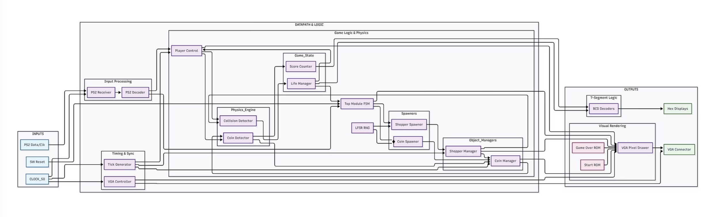

# Shopping Cart Rush: A VGA-Based Arcade Engine on FPGA

[-blue)](#hardware-specifications)

A real-time, hardware-accelerated 2D endless-runner arcade game engineered in Verilog HDL for the Intel Cyclone V SoC FPGA. The system interfaces directly with a VGA monitor, PS/2 keyboard, and onboard 7-segment displays to deliver a complete hardware arcade experience with deterministic, zero-latency frame rendering.

---

> ### ⚠️ Academic Integrity Policy Disclaimer
> In compliance with the **University of Toronto Code of Behaviour on Academic Matters**, raw Verilog source code (`.v` files) is omitted from this public repository to safeguard the academic integrity of future course offerings. This repository serves as a **public technical specification, architectural review, and simulation verification artifact**. Verified simulation waveforms, schematics, and presentation media are documented below. Verilog modules and testbenches can be reviewed privately upon direct request by engineering hiring teams.

---

## Hardware Demonstration

* **Video Demonstration:** [View Hardware Run (project_demo.mp4)](./project_demo.mp4)
* **Presentation Slide Deck:** [Download Architectural Slides (PDF)](./Project_Presentation_Slides.pdf)

---

## System Overview & Gameplay Mechanics

**Shopping Cart Rush** puts players in control of a supermarket cart navigating five discrete lanes, dodging oncoming shoppers while collecting coins to maximize their score. The game engine features dynamic difficulty scaling, where both shopper spawn rates and obstacle approach speeds accelerate proportionally with player score.

### Key Hardware Features
* **Zero-Latency Video Subsystem:** Custom 640×480 @ 60 Hz VGA timing generator and pipelined pixel drawer reading from on-chip M10K ROMs.
* **Deterministic Object Spawning:** 16-bit Linear Feedback Shift Register (LFSR) for pseudo-random lane distribution and obstacle spacing.
* **Single-Cycle Collision Engine:** Discrete coordinate bounding-box overlap detection evaluating cart-to-obstacle collisions simultaneously every game tick.
* **Onboard Telemetry:** Real-time binary-coded decimal (BCD) score tracking output directly to onboard HEX displays.

---

## Microarchitecture & Hardware Subsystems

The design follows a decoupled **Datapath and Control** architecture operating off the master 50 MHz system clock:

### 1. Video & Graphics Pipeline
* **Timing Generator:** Synthesizes standard 25.175 MHz pixel clocks from the master 50 MHz clock to drive active horizontal ($640$ px), vertical ($480$ px), front/back porch, and sync pulse timings.
* **Pipelined Pixel Drawer:** Resolves coordinate offsets for five gameplay lanes, dynamic player sprites, moving shopper/coin objects, and static background boundaries.
* **On-Chip ROM Assets:** Pre-compiled `.mif` (Memory Initialization Files) mapped into Cyclone V embedded M10K memory blocks for static title and game-over screens.

### 2. Game Logic & Control (FSM)
* **Finite State Controller:** A synchronous FSM controls master operational modes: `START_SCREEN`, `ACTIVE_PLAY`, `COLLISION_LATCH`, and `GAME_OVER`.
* **Dynamic Speed Regulation:** Evaluates cumulative player score and scales the vertical displacement frequency, capping velocity through hardware saturation logic.
* **Input Conditioning:** Dedicated PS/2 decoder with request-latching flip-flops to capture asynchronous, single-cycle key-press events reliably across the ~60 Hz game ticks.

### 3. Subsystem Interconnect

---

## Engineering Challenges & Hardware Debugging

| Challenge Encountered | Root Cause | Implemented Hardware Solution |
| :--- | :--- | :--- |
| **VGA Signal Glitching & Runt Pulses** | Complex combinational pixel-color selection logic exceeded the 25 MHz propagation delay window ($<39.7\text{ ns}$), causing visible color tearing and line artifacts. | Implemented an **output pipeline register stage**, registering the evaluated pixel color one clock cycle prior to driving the external VGA DAC pins. |
| **Dropped PS/2 Keyboard Inputs** | Key-press pulses generated by the 50 MHz PS/2 receiver lasted only a single clock cycle ($20\text{ ns}$), causing the slower ~60 Hz game tick logic to miss over 95% of inputs. | Engineered **input latching flags**: each verified keypress sets a persistent flag cleared only upon consumption by the subsequent `game_tick`. |
| **Object Freeze at Score = 36** | The obstacle speed accumulator register was originally sized at 4 bits ($0\text{--}15$). Once score reached 36, arithmetic overflow wrapped the register back to 0. | Expanded register width to **10 bits** and added **arithmetic saturation logic** to clamp maximum speed without overflow. |

---

## Simulation & Verification (ModelSim)

Every digital module was simulated and verified for cycle-accurate behavior in ModelSim before board deployment:

### 1. Master FSM & Game State Transitions
Verifying synchronous state transitions from `START` (`00`) to `PLAY` (`01`) upon user input, life count tracking, and immediate assertion of game-over display states upon terminal collision.

### 2. Dynamic Speed Scaling Logic
Validating that increases in score trigger proper scaling of obstacle vertical step rates (`shopper_y`) without causing clock-edge setup/hold hazards.

### 3. Multi-Object Spawning & Collision Logic
Simulating 16-bit LFSR pseudo-random lane selection, simultaneous coin and shopper tracking, and single-cycle `hit` pulse assertions for score incrementation and coordinate clearance.

---

## Hardware Specifications

* **FPGA Target:** Intel Cyclone V SoC (5CSEMA5F31C6)
* **Master Clock:** 50 MHz onboard oscillator
* **Pixel Clock:** 25.175 MHz (derived)
* **Display Format:** 640 × 480 @ 60 Hz standard VGA
* **Inputs:** PS/2 Keyboard interface, active-low pushbutton switches
* **Outputs:** 24-bit VGA DAC, 6-digit 7-segment displays (BCD format)
* **EDA Toolchain:** Intel Quartus Prime Standard Edition, Mentor Graphics ModelSim
